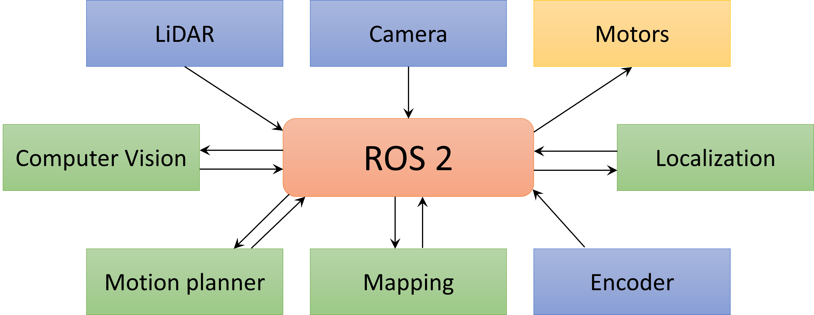

# Chapter 1 - ROS 2 Foundations and Core Concepts

This chapter introduces ROS and its core concepts, and gives an insight into why it is important to learn it. It also guides you to create your first workspace, first package, and run a couple of nodes to test your installation.

## Objectives

By the end of this chappter you should be familiar with:

- What ROS is, a bit of its history and its design philosophy.
- The uses of ROS in the industry.
- The core concepts of ROS (nodes, messages, topics, workspaces, packages...).
- How to create and build a ROS workspace to run your code.

## 1.1 ROS Overview

ROS is short for **Robot Operating System**. Just like a computer operating system, ROS manages hardware and software resources, and provides common services for other programs to interact with each other and with the robot hardware (sensors and actuators).

However, despite its name, ROS is **_not_** an operating system, but **a middleware with a set of communication tools and a collection of plug-and-play libraries** that shorten the time-to-market of robotics projects and allows developers to work on the algorithms they are interested in.

ROS is an open-source robotics framework that allows developers and researchers to build and reuse code between robotics applications. Besides its pre-built tools to handle inter-process communication, ROS has many tool that are relevant to robots, like device drivers, simulation and visualization, data logging etc.. Finally, there is a vast community that provides packages for common robotics applications.

### The ROS Development Approach

ROS’s design philosophy is unique and is at the heart of why it has become so commonplace in the robotics community.

ROS is :

1. **Multiplatform**: Works on Linux, Windows, MATLAB, etc..
2. **Modular**: ROS projects are designed to be completely modular, which allows for reusability and both accelerates and facilitates team work.
3. **Multi-lingual**: ROS projects can be written in many languages. Although the main supported languages are Python and C++, there are client libraries for MATLAB, Go, Ruby, NodeJS and many more.
4. **Multidomain**: Can be used for all kinds of robotics applications, from underwater vehicles to moonlanders!
5. **Open-Source**: ROS is completely open source, all its tools and almost all of the community-provided libraries are free to use.

### A brief history of ROS

ROS was first developed by two Stanford researchers to accelerate the initial phase of development of most robotics projects, which mostly consisted of what  they described as "reinventing the wheel". ROS was later picked up by robotics incubator [Willow Garage](https://en.wikipedia.org/wiki/Willow_Garage), which continued its development until it was dissolved and the project was picked up again by [Open Robotics](https://www.openrobotics.org/), which is the current entity behind ROS.

As ROS began initially as a platform for researchers, it had become apparent by 2015 that its current capabilities were not adequate for widespread commercial use. The second generation of ROS - **ROS 2** - was created as a direct result of such realization. ROS 2 was built from the ground-up to solve the identified issues and to be able to handle industrial and commercial applications. This course focuses on ROS 2.

### Why ROS?

The most important question to ask when adopting a new technology is why? Why should I spend the time and effort to learn and  become familiar with this new technology, after all, new technologies come and go very quickly in the software world.

The development of ROS 2 was and continues to be guided by a ‘Technical Steering Committee’ composed by several representatives of the robotics community. The wide spread usage of ROS in the robotics field makes it one of the most important tools to master for developers or engineers wanting to enter the field of robotics.

ROS currently powers robots in various domains, from [Astrobee](https://www.nasa.gov/astrobee), NASA’s free-flying robots that have been active in the ISS for years, to [Open-RMF](https://www.open-rmf.org/), a modular software system that enables sharing and interoperability between multiple fleets of robots and physical infrastructure, like doors, elevators and building management systems.

[ROSIndustrial](https://rosindustrial.org/) is an extension of the ROS platform specifically made to facilitate the transfer of robotics research into the industrial field. It currently boasts over industrial leaders from all around the world such as ABB, Boeing, BMW, Intel, Lely, Johnson & Johnson, Mitsubishi, Panasonic, Siemens, Universal Robots, Volvo, and many more. See all [current members of the ROS Industrial consortium here](https://rosindustrial.org/current-members).

## 1.2 Main Concepts

As mentioned before, ROS is a middleware with a set of communication tools and a collection of plug-and-play libraries. It provides services like hardware abstraction, low-level device control, and message-passing between processes and package management. ROS also has a wide variety of common robotics tools and algorithms, like data visualization, robot navigation and mapping, perception, simulation, etc.

ROS provides a communication infrastructure for different software to control a robot. Figure 1 illustrates an example: individual programs (nodes) are responsible for specific functions, like communicating with hardware (blue and yellow blocks) or processing data (green blocks). ROS provides a communication infrastructure for them to exchange messages.


##### Figure 1. Illsutration of a ROS application example: ROS acts as a middleware, coordinating message passing between different software (nodes). 

Let's go over a few important ROS concepts. We will dive into those concepts in the next chapter.

### Nodes

ROS is designed to be very modular, so a robot control system is broken down into single purpose, independently executable programs, called nodes (as illustrated in Figure 1). Nodes can be written in any ROS-compatible language, like C++ or Python, and are made to complete a single, independent task. For example, one node controls a laser range-finder, another node controls the wheel motors, and yet another node performs localization etc..

### Messages

Nodes communicate using messages. A ROS message is just a data structure that contains one or more fields. These fields usually have a type belonging to one of the primitive data types (Integer, Floating Point, Boolean, String). Messages can also include arrays and may be nested to add hierarchy or separation to the data.

### Topics

ROS messages are sent through topics, which follow a simple publish/subscribe protocol. Nodes can publish messages to a topic to share that data across the application, and other nodes can subscribe to that topic to access that data. Figure 2 illustrates such concept: one node publishes messages to a topic that has another node as subscriber. In this configuration, the subscriber node receives all messages as soon as they are published to the topic. A single topic can have multiple subscribers and multiple publishers.


##### Figure 2. Nodes exchanging messages via a topic. _Source: [ROS 2 Documentation: Jazzy](https://docs.ros.org/en/jazzy/Tutorials/Beginner-CLI-Tools/Understanding-ROS2-Topics/Understanding-ROS2-Topics.html)_

For example, a node `/lidar_sensor` might process data from the lidar sensor and publish distance data to a topic called `/distance_data`. The `/localization` node subscribed to the `/distance_data` topic can use that data to help compute the robot’s current location.

### Bags

ROS Bags are a format for saving and playing back ROS message data. Bags are useful in applications that require data persistence and are usually used to store sensor data that requires cumulative processing that is sometimes needed to develop or refine algorithms. For example, you can save all sensor data and commands to a ROS Bag and later replay it using a RViz (a ROS Vizualization tool) to investigate performance and diagnose problems.

### Computation Graph

The ROS Computation Graph is the network of peer-to-peer processes that compute data and together make up a complete application. The graph consists of the nodes, topics, messages, bags, and services that together constitute a complete ROS project.

### Distributions

Different versions of ROS are called distributions (current distributions are only being released for ROS 2). Each distribution is designed to work with specific versions of operating systems. Once a distribution is released, changes are limited to bug fixes and non-breaking improvements.

This course was designed for the distribution called _Jazzy Jalisco_ (often called only _Jazzy_), which was released on the 23rd of May 2023 and will reach EOL (end-of-life) in May 2029. Jazzy works in other platforms, but best supports Ubuntu 24.04 (amd64 and arm64) and Windows 10 (amd64) as Tier 1 (best support). Because of its best support, we are focusing on Ubuntu 24.04 in this course.

A list of [ROS 2 distributions](https://docs.ros.org/en/jazzy/Releases.html) and associated documentation is available at the ROS 2 Documentation website.

> _Curiosity:_ Each version of ROS has been named after some sort of turtle and have a turtle as a symbol. New ROS 2 distributions are released yearly on the 23rd of May (World Turtle Day).

### Packages

ROS 2 packages are modular software units that provide specific functionalities for robotics applications. In other words, a package is a folder (directory) that contains everything needed for your robot’s software (or part of it): scripts, config files, dependencies etc.. For example, a sensor package contains the sensor driver and necessary configuration files to use it. ROS 2 software is shared as packages.

### Workspace

A ROS workspace is a directory with a particular structure that houses ROS projects. Each workspace can contain one or many packages related to the same project. In general, it is recommended that each ROS project should be in a dedicated workspace. This allows for clear separation between packages and makes building projects a lot more hassle-free.

The minimum requirement for a ROS workspace is a `/src` directory that contains the source code for all the packages organized into sub-directories. The structure of a ROS 2 workspace typically consists of 4 sub-directories:

```bash
.
├── build
├── install
├── log
└── src
```

- `/build` is where intermediate files are stored. For each package, a sub-directory will be created.
- `/install` is where each package will be installed to. By default, each package will be installed into a separate sub-directory, i.e: `/install/package_name`.
- `/log` contains logs about each build invocation.
- `/src` contains all the source code. This is the directory where you can create new files and clone source code from other sources.

### 1.2.1 Activity: Creating your own workspace

This activity will focus on creating a new workspace that will be used later in this course. You will create a workspace, create a package within such workspace, create executable scripts and run them. The goal is for you to become familiar with the process and to have a source for future refences.

> _Note:_ I am assumming that you have ROS 2 Jazzy installed on Ubuntu. If not, you can install it using a virtual machine by following [this guide](../../Part_1-ROS/ros2_vm_guide.md).

In most activities in this course (and with ROS) we will make use of terminal commands (or command line). If you are new to Linux, I recommend the tutorial [The Linux command line for beginners](https://ubuntu.com/desktop/docs/en/latest/tutorial/the-linux-command-line-for-beginners/). Don't worry if you don't know all terminal commands by heart! In this course, the necessary commands will be provided. I recommend that you **type the commands yourself** (instead of copying them) to increase your chances of getting familiar with the common Linux terminal commands and with common ROS terminal commands.

#### Step 1 - Create an empty directory

To create a ROS workspace, we need to start with an empty directory. Open a Terminal, navigate to your home directory and create an empty one named `create3_ws`:

```bash
cd ~
mkdir create3_ws
```

Navigate to your new folder and create a new directory called `src` (the terms _folder_ and _directory_ have the same meaning and are used interchangeably):

```bash
cd create3_ws
mkdir src
```

#### Step 2 - Source ROS 2

_Sourcing_ is a very important step that allows ROS 2 commands to be found. You can source ROS 2 Jazzy by running the command below:

```bash
source /opt/ros/jazzy/setup.bash
```

**Every time a new terminal is opened, it must be sourced.** To avoid typing the above command every time you open a new terminal window, you can include it on your `.bashrc` file. The `.bashrc` is a script that is executed everytime you open a new terminal, so including the source command there will save you from typing it every time you open a new terminal.

If you installed ROS 2 by following the virtual machine instructions linked above, then the command is already included in your `.bashrc`. If not, you can include it by running the following command (this one I actually recommend you to copy to avoid typo's):

```bash
echo "source /opt/ros/jazzy/setup.bash" >> ~/.bashrc
```

#### Step 3 - Create a Python package

Python packages are created in the `src` folder of your workspace. First, navigate to that folder:

```bash
cd ~/create3_ws/src
```

Now, run the command below to create a Python package called `create3_pkg` with dependencies `rclpy` and `std_msgs`:

```bash
ros2 pkg create create3_pkg --build-type ament_python --dependencies rclpy std_msgs
```

This command creates sub-folders and configuration files necessary for ROS 2.

#### Step 4 - Create the Python scripts

Now, you will create two Python scripts: `simple_publisher.py` and `simple_subscriber.py`. When running, each script will be a _node_ on your ROS 2 _computation graph_: one will publish _messages_ on a _topic_, while the other will subscribe to the same topic to receive such messages.

To create the Python scripts, first navigate to the directory that hosts scripts inside your package (yes, that folder has the same name as your package):

```bash
cd ~/create3_ws/src/create3_pkg/create3_pkg
```

Now, run the commands below to create the two empty files:

```bash
touch simple_publisher.py
touch simple_subscriber.py
```

Change the properties of both files to make them executables:

```bash
chmod +x simple_publisher.py
chmod +x simple_subscriber.py
```

Open `simple_publisher.py` on your favorite editor (the command below will open it on VSCode):

```bash
code simple_publisher.py
```

Copy the code below and paste it on the `simple_publisher.py` file. For now, just copy the code as given. In the next chapter we will explain in detail what each part of the script is doing.

```python
#!/usr/bin/env python3

import rclpy
from rclpy.node import Node
from std_msgs.msg import String

class SimplePublisher(Node):
    def __init__(self):
        super().__init__('simple_publisher')
        self.publisher_ = self.create_publisher(String, 'chatter', 10)
        self.timer = self.create_timer(1.0, self.publish_message)
        self.counter = 0

    def publish_message(self):
        msg = String()
        msg.data = f'Hello ROS2! Count: {self.counter}'
        self.publisher_.publish(msg)
        self.get_logger().info(f'Published: "{msg.data}"')
        self.counter += 1

def main(args=None):
    rclpy.init(args=args)
    node = SimplePublisher()
    rclpy.spin(node)
    node.destroy_node()
    rclpy.shutdown()

if __name__ == '__main__':
    main()
```

Save the file and close the editor.

Now, open `simple_subscriber.py` on your favorite editor (the command below will open it on VSCode):

```bash
code simple_subscriber.py
```

Copy the code below and paste it on the `simple_subscriber.py` file.

```python
#!/usr/bin/env python3

import rclpy
from rclpy.node import Node
from std_msgs.msg import String

class SimpleSubscriber(Node):
    def __init__(self):
        super().__init__('simple_subscriber')
        self.subscription = self.create_subscription(String, 'chatter',
            self.listener_callback, 10)

    def listener_callback(self, msg):
        self.get_logger().info(f'Received: "{msg.data}"')

def main(args=None):
    rclpy.init(args=args)
    node = SimpleSubscriber()
    rclpy.spin(node)
    node.destroy_node()
    rclpy.shutdown()

if __name__ == '__main__':
    main()
```

Save the file and close the editor.

#### Step 5 - Edit setup.py

You need to edit the configuration file `setup.py` to inform ROS 2 about your newly created nodes. First, navigate to the package folder:

```bash
cd ~/create3_ws/src/create3_pkg
```

Then, open `setup.py` on your favorite editor (here we are using VSCode):

```bash
code setup.py
```

Find the `entry_points` section and replace it with:

```python
entry_points={
    'console_scripts': [
        'simple_publisher = create3_pkg.simple_publisher:main',
        'simple_subscriber = create3_pkg.simple_subscriber:main',
    ],
},
```

#### Step 6 - Build the workspace

Build tools are programs that automate the creation of executable files from source code. Building our workspace is what allows us to use ROS commands to run the scripts.

The build tool used in ROS 2 is `colcon`, which has many features that help building and managing ROS workspaces, and will generate the `/build`, `/install`, and `/log` directories automatically.

First, navigate to your main workspace directory, then build it using the `colcon build` command:

```bash
cd ~/create3_ws
colcon build
```

> **Important**: Always make sure you are in the main workspace directory before running the build command!

For now, this process will be fast. But, depending on the size of your workspace and the speed of your system, it can take several minutes.

When the build process is complete, you should see a message similar to the one below (maybe with some extra warnings):

```bash
Starting >>> create3_pkg
Finished <<< create3_pkg [1.08s]          

Summary: 1 package finished [1.20s]
```

Now, if you list the content of the `create3_ws` directory and new sub-directories, you will see that a lot of files were created during the building process.

#### Step 7 - Source your workspace

Now that we built our workspace, it is time to _source_ it. _Sourcing_ a workspace is a very important step that allows the packages to be usable.

You will need to **source your workspace every time you open a new terminal** in order to run the packages installed in it. 

To source our workspace, we will run a bash script created during the building process and stored in the `install` sub-directory of the workspace:

```bash
cd ~/create3_ws
source install/_setup.bash
```

Alternatively, you can add this line to the end of the `.bashrc` file, which is ran every time a new terminal is opened. However, this is _not_ recommended as it might sometimes create conflicts, especially if you are working with different workspaces.

#### Step 8 - Run the scripts from your workspace

It's finally time to test run the publisher and subscriber scripts! To run ROS 2 code, use the command `ros2 run <package_name> <script_name>`. First, let's run the publisher node:

```bash
ros2 run create3_pkg simple_publisher 
```

You should see a message like the one below every second, with an incrementing count value:

```txt
[INFO] [1784937163.036289944] [simple_publisher]: Published: "Hello ROS2! Count: 0"
```

To run the subscriber node, you must open a new terminal. Remember that **you must source your workspace on the new terminal**:

```bash
cd ~/create3_ws
source install/_setup.bash
```

Then, you can run the subscriber node:

```bash
ros2 run create3_pkg simple_subscriber 
```

You should see messages like the one below, with the count value that corresponds to the one published by the publisher node:

```txt
[INFO] [1784937202.042355571] [simple_subscriber]: Received: "Hello ROS2! Count: 39"
```

You might have observed that the subscriber receives only the messages that are published _after_ it starts running. In other words, messages published to topics are not stored and will be lost if no subscriber is listening to that topic at the time of publication.

## Conclusion

After completing this chapter, you should have a general understanding of the fundamental concepts of ROS and its importance for the robotics community. You should also have a workspace prepared for the next activities of this course. In Chapter 2 we will dive into some core topics to better understand how to work with ROS 2 and how to write Python code for it.

## Navigation menu

- Continue to [Chapter 2 - Building ROS 2 Applications](../../Part_1-ROS/Chapter-2/readme.md)
- Go back to [Part 1 - ROS](../../Part_1-ROS/readme.md)
- Go to the [Main page](../../readme.md)