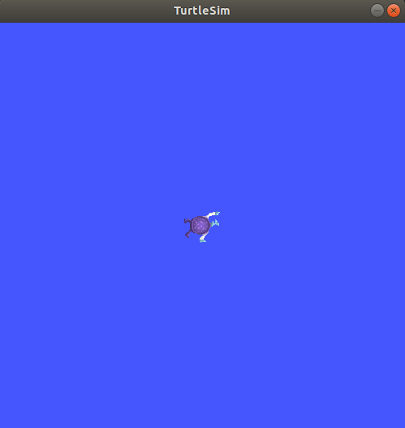

# Chapter 2 - Building ROS 2 Applications

This chapter dives into two essential communication paradigms in ROS (Node-Topic and ROS Actions), and shows how to create Python code to implement ROS 2 nodes that communicate with each other.

## Objectives

By the end of this chapter you should be able to:

- Interact with and inspect ROS nodes, topics, and actions from the terminal.  
- Read sensor data from various topics.
- Create custom nodes using Python3 that can both subscribe and publish to ROS topics.
- Understand how ROS actions work.

## 2.1 TurtleSim

As mentioned in Chapter 1, each ROS distribution is named after a turtle, gets a turtle as a symbol, and is released yearly on the World Turtle Day (23rd of May). But the connection between ROS and turtles goes further. The story goes way back to the 1940’s, when William Grey Walter created some of the first autonomous mobile robots and named them [turtles](http://www.theoldrobots.com/ElmerElsie.html). Years later (in the 1960’s), Dr. Seymour Papert, a professor at MIT, began to use _turtle robots_ for education. One of the characteristics of Papert's robots was their ability to draw on paper. Dr. Papert is also known as the creator of the educational programming language LOGO, which uses “turtle graphics”, a system that allows users to draw by sending simple commands to a simulated robotic turtle. TurtleSim mimics such characteristics.

TurtleSim is a lightweight simulator used for learning ROS. It is a simple simulation environment that allows you to practice concepts and learn what ROS 2 does at the most basic level. TurtleSim is a good starting point for understanding the basics and to get an idea of what we will do when handeling a real robot. Figure 1 shows a screenshot of TurtleSim with the turtle in the center.



##### Figure 1. TurtleSim screenshot - the turtle in the center simulates a robot that can be controlled via mesages published to specific topics. _Source: [ROS Docs](https://docs.ros.org/en/jazzy/Tutorials/Beginner-CLI-Tools/Introducing-Turtlesim/Introducing-Turtlesim.html)_

## 2.2 Nodes and Topics

Node-topic communication is the most common communication paradigm used in ROS projects. It is most commonly used between nodes that publish/subscribe to continuous streams of data as is the case with most sensor data.

### 2.2.1 Nodes

As mentioned before, nodes are modular, executable programs that serve a single purpose, such as controlling a motor or recording data from a sensor. A complete robotics project in ROS consists of multiple nodes running simultaneously.

Nodes can communicate with other nodes in a variety of ways, the most common method being through topics.

### 2.2.2 Activity: Running and inspecting nodes

For this activity, we will be exploring a few ROS 2 commands that allow us to interact with and inspect nodes. This activity can also be found in the [ROS2 wiki](https://docs.ros.org/en/jazzy/Tutorials/Beginner-CLI-Tools/Understanding-ROS2-Nodes/Understanding-ROS2-Nodes.html).

The command `ros2 run` launches an executable from a package:

```bash
ros2 run <package_name> <executable_name>
```

The TurtleSim executable is called `turtlesim_node` and belongs to the package `turtlesim`. To run it, open a new terminal and enter the following command:

```bash
ros2 run turtlesim turtlesim_node
```

This will launch a node from the _turtlesim_ package and the TurtleSim window will open. To learn the node's name in the ROS compute graph, we can ask ROS to list all running nodes:

```bash
ros2 node list
```

This will show the names of all running nodes and is useful when you want to interact with a node, or when you have a system running many nodes and need to keep track of them.

In our case, there is only one node running, so the terminal will return the node name:

```bash
/turtlesim
```

Now, let's start the Turtle Teleoperation node to control the simulated turtle. Open another new terminal and run the command:

```bash
ros2 run turtlesim turtle_teleop_key
```

Here, we are searching the `turtlesim` package again, this time for the executable named `turtle_teleop_key`.

Return to the terminal where you ran `ros2 node list` and run it again. You will now see the names of two active nodes:

```bash
/turtlesim
/teleop_turtle
```

You can also visualize the nodes (and much more) with `rqt`, which is a GUI toolkit and dashboard that provides many plugins for inspecting and interacting with a ROS system. You can call it by simply running:

```bash
rqt
```

When running it for the first time, the window will be blank. Select `Plugins > Introspection > Node Graph` from the menu bar at the top. A window like the one in Figure 2 will open showing the nodes that are publishing or subscribing to which topics (if the window is blank, click the "reload" button next to the drop-down menu showing "Nodes only"). The diagram shows that messages are flowing from the `/teleop_turtle` node to the `turtlesim` node via the topic `/turtle1/cmd_vel`. In other words, `/teleop_turtle` publishes and `/turtlesim` subscribes to the topic `/turtle1/cmd_vel`. Figure 2 also shows that the node `turtlesim` exposes two actions (feedback and status). We are going to discuss actions in Section 2.3.


##### Figure 2. Node graph in rqt: it shows the running nodes and indicates which one is publishing or subscribing to which topic.

With `rqt` you can also plot graphs, inspect topics, call services, change parameters and more. Play with the options a bit to see some of the different visualization possibilities.

You can close the `rqt` window now, but keep the TurtleSim and Teleop nodes running for the next activity.

---

### 2.2.3 Topics

Topics are a vital element of the ROS graph that act as a bus for nodes to exchange messages. Topics can receive messages from one or more nodes publishing to it, and deliver those messages to one or more nodes that are subscribed to it. A node may publish to a topic or to multiple topics, and simultaneously have subscriptions to one or more topics. Figure 3 illustrates this concept.


##### Figure 3. Nodes exchanging messages via topics. _Source: [ROS 2 Documentation: Jazzy](https://docs.ros.org/en/jazzy/Tutorials/Beginner-CLI-Tools/Understanding-ROS2-Topics/Understanding-ROS2-Topics.html)_

### 2.2.4 Activity: Working with topics

In this activity, you will get familiar with ROS topics using some `ros2`
commands and the `turtlesim` package. This activity can also be found in the [ROS 2 wiki](https://docs.ros.org/en/jazzy/Tutorials/Beginner-CLI-Tools/Understanding-ROS2-Topics/Understanding-ROS2-Topics.html).

First, let us get a list of all running topics. Open a new terminal and run the command `ros2 topic list`. You will get a list of all the topics currently active in the system. If you still have TurtleSim and teleop running, the list will be similar to:

```bash
/parameter_events
/rosout
/turtle1/cmd_vel
/turtle1/color_sensor
/turtle1/pose
```

The command `ros2 topic list -t` will return the same list of topics, but with the message type associated to each topic (between square brackets):

```bash
/parameter_events [rcl_interfaces/msg/ParameterEvent]
/rosout [rcl_interfaces/msg/Log]
/turtle1/cmd_vel [geometry_msgs/msg/Twist]
/turtle1/color_sensor [turtlesim/msg/Color]
/turtle1/pose [turtlesim/msg/Pose]
```

These attributes, particularly the message type, are how nodes know they’re talking about the same information as it moves over topics.

To see the data being published on a topic, use the `ros2 topic echo` command:

```bash
ros2 topic echo <topic_name>
```

The node `/teleop_turtle` publishes messages to `/turtle1/cmd_vel` topic. The node `/turtlesim` subscribes to the same topic and moves its simulated turtle according to the received messages. Let's use `echo` to introspect on that topic:

```bash
ros2 topic echo /turtle1/cmd_vel
```

This command won’t return any data if no message is published to the topic. Go to the terminal where `turtle_teleop_key` is running and click the arrows to move the turtle around. Watch the terminal where your `echo` is running at the same time, and you’ll see velocity data being published for every movement you make. It should look something like this:

```bash
linear:
  x: 2.0
  y: 0.0
  z: 0.0
angular:
  x: 0.0
  y: 0.0
  z: 0.0
  ---
```

In this case, the topic is a point-to-point communication, but this is not a requirement. As shown in Figure 3, communication can be one-to-many, many-to-one, or many-to-many. Another way to look at this is running:

```bash
ros2 topic info /turtle1/cmd_vel
```

Which will return information about the message type, number of publishers and number of subscribers to that topic:

```bash
Type: geometry_msgs/msg/Twist
Publisher count: 1
Subscription count: 2
```

Yo might have noticed that the subscription count is 2, which means that there are 2 nodes subscribed to the topic `/turtle1/cmd_vel`. One subscriber is the `/turtlesim` node, as expected. The other is the `echo` node, which also subscribes to the topic in order to print its values on screen. If you stop the `echo` node with <CTRL+C> and run `ros2 topic info /turtle1/cmd_vel` again, you will see that the subscription count decreases to 1.

Nodes can publish and/or subscribe to topics to send and/or receive messages. Publishers and subscribers must send and receive the same **type of message** to communicate via a topic. From the topic types we saw earlier after running `ros2 topic list -t`, we know that the `cmd_vel` topic has the type `geometry_msgs/msg/Twist`. This means that in the package `geometry_msgs` there is a `msg` called `Twist`. 

Now, let's run `ros2 interface show <msg type>` to learn its details, specifically, what structure of data the message expects:

```bash
ros2 interface show geometry_msgs/msg/Twist
```

The output is:

```bash
Vector3  linear
Vector3  angular
```

This tells you that the `Twist` expresses velocity as two vectors of three elements each. Those vectors are called `linear` and `angular`. This is exactly the type of data we saw `/teleop_turtle` passing to `/turtlesim` with the `echo` command:

```bash
linear:
  x: 2.0
  y: 0.0
  z: 0.0
angular:
  x: 0.0
  y: 0.0
  z: 0.0
```

You can stop the running nodes for now: go the respective terminals and type <CTRL+C>.

---

### 2.2.5 Activity: Writting Python code for topics

Although the terminal commands are very useful, we can't create complete projects this way. This activity will focus on creating a couple of talker-listener ROS 2 nodes using Python. One node - the talker - will send a simple string message, and the second node - the listener - will print the received message to the terminal.

#### Step 1 - Study the structure of the Python script

Before starting the activity, we are going to go over the general structure of the Python scripts we will handle during this workshop and explain what each section does.

The code below just publishes the message "Marco!" every 0.5 seconds. Its structure is similar to the one that we ran in Chapter 1, but some details are different (like the message published, the topic name, and the frequency of publication). A comparison between the script below and the one from Chapter 1 is left as an exercise.

For now, read the code and associated comments. We explain each section later.

```python
#!/usr/bin/env python3

# Import Libraries
import rclpy
from rclpy.node import Node
from std_msgs.msg import String

# Define the talker class based on the Node class from rclpy library
class talker(Node):
  # Constructor Method
  def __init__(self):
    # Create a node with name "talkerNode"
    super().__init__("talkerNode")
    # Create a publisher to the "myTopic" topic
    self.publisher = self.create_publisher(String, "myTopic", 10)
    
    # Define a timer_period variable
    timer_period = 0.5  # seconds
    # Create a timer to call the function timer_callback every timer_period
    self.timer = self.create_timer(timer_period, self.timer_callback)

  # Timer callback method
  def timer_callback(self):
    # Initialize empty message of type String
    msg = String()
    # Add data to the message
    msg.data = "Marco!"
    
    # Publish the message
    self.publisher.publish(msg)
    print("Publishing...")

# Main Function
def main():
  # Initialize rclpy
  rclpy.init()
  # Instantiate the talker class
  publisherNode = talker()
  # Spin Node(s)
  rclpy.spin(publisherNode)

# Call the main() function
if __name__ == '__main__':
  main()
```

Let's understand what each section of the code is doing.

##### Defining the Python interpreter

The first line (`#!/usr/bin/env python3`) is there just to tell Linux which program to use to run the script when you execute it directly. It tells the OS to find the `python3` program in your system's PATH and use it to run the script (assumming it is executable).

Even if you omit this line, running your script with `python3 talkerDemo.py` still works. However, running directly with `./talkerDemo.py` may fail because the operating system might not know which interpreter to use.

In summary, it is good practice to add `#!/usr/bin/env python3` at the start of your Python scripts when working with ROS 2.

##### Importing libraries

The first section of the code consists of importing the necessary libraries. We need to import the class `Node` from `rclpy.node` and the class `String` from `std_msgs.msg`:  

```python
# Import Libraries
from rclpy.node import Node
from std_msgs.msg import String
```

In ROS 2, `rclpy` and `std_msgs` are two fundamental packages:

- `rclpy` is the ROS 2 Python client library. It is the primary library that you will see being used in basically all Python scripts for ROS because it provides the API for creating ROS 2 nodes, publishers, subscribers, services, actions, and timers we will use in Python code.

- `std_msgs` is a package that contains standard message definitions used for communication between ROS 2 nodes. These messages define data types such as strings, integers, floats, and booleans.

A ROS 2 node written with `rclpy` often uses message types from `std_msgs`, so you will often see both libraries being used.

##### Defining the talker class

ROS 2's coding conventions encourage us to write object-oriented code, meaning we should organize our code into classes. We define our `talker` class as a subclass of the `Node` class provided by `rcply`. Doing so allows our class to create a node, add subscribers and publishers, and do everything a ROS 2 node can do.

```python
# Define the talker class based on the Node class from rclpy library
class talker(Node):
```

##### The constructor method

The `__init__` function is the constructor method of our `talker` class. This is the method that is called everytime we create an instance of our class (an object).

Inside our constructor function, we usually create publishers and subscribers to the topics we want, define variables we will use, and place any other code that needs to be executed once when the talker object is created.

```python
class talker(Node):
  # Constructor Method
  def __init__(self):
    # Create a node with name "talkerNode"
    super().__init__("talkerNode")
    # Create a publisher to the "myTopic" topic
    self.publisher = self.create_publisher(String, "myTopic", 10)
    
    # Define a timer_period variable
    timer_period = 0.5  # seconds
    # Create a timer to call the function timer_callback every timer_period
    self.timer = self.create_timer(timer_period, self.timer_callback)
```

##### Other methods

After defining the `__init__` method, we should define other methods for the class. In most cases, this usually means defining _callback_ functions, which are functions that are called automatically when a certain pre-defined event happens. In our case, we define a _timer callback_ that is called everytime the timer's period elapses. Notice that the _timer object_ was created in the constructor method using the `create_timer` function. The method below is what is going to be called every `timer_period` seconds.

```python
  # Timer callback method
  def timer_callback(self):
    # Initialize empty message of type String
    msg = String()
    # Add data to the message
    msg.data = "Marco!"
    
    # Publish the message
    self.publisher.publish(msg)
    print("Publishing...")
```

We did not do it, but we could also have subscribers to other topics. If we were to create a subscriber, we would also define subcriber callback functions, which are called every time a message is published to that topic.

##### Defining the main() function

In this section, we define our `main` function, which is where we _instantiate_ our classes and where all our "high-level" logic can go. In our case, we just initialize `rclpy`, create an instance of our `talker` class called `publisherNode`, and call the `rclpy.spin()` function.

```python
# Main Function
def main():
  # Initialize rclpy
  rclpy.init()
  # Instantiate the talker class
  publisherNode = talker()
  # Spin Node(s)
  rclpy.spin(publisherNode)
```

Calling both `rclpy.init()` and `rclpy.spin()` functions is necessary to initialize and keep the script running until it is terminated (there is no explicit loop function!).

##### Calling the main function

Finally, we call our `main` function to actually run our code. Before calling our main function however, we need to verify that this script is being ran explicitly. We do that via the `if __name__ == '__main__'` check. Although not required, it is good practice to always add this check.

```python
# Call the main() function
if __name__ == '__main__':
  main()
```

#### Step 2 - Create the talkerDemo.py

Now that you have a better understanding about the code, let's include it in your package.

Go to your `create3_pkg` directory, create a new file called `talkerDemo.py`, and copy the above code to it.

If you need a refresher of how to do this, please review [step 4](../../Part_1-ROS/Chapter-1#step-4---create-the-python-scripts) of the activity in Chapter 1.

#### Step 3 - Create the listenerDemo.py

We will now create the code for the subscriber node. Go to your `create3_pkg` directory, create a new file called `listenerDemo.py`, and copy the template code below to it.

```python
#!/usr/bin/env python3

import rclpy
from rclpy.node import Node

#! Write your code here!
# Import the String message from the std_msgs package

class listener(Node):
  def __init__(self):
    super().__init__("listener")
    self.subscriber = self.create_subscription(String,"myTopic",self.sub_callback,10)

  def sub_callback(self,msg):
    
    #! Write your code here! 
    #Print the message to the terminal
        

def main():
  rclpy.init()

  #! Write your code here! 
  # Create an instance of your class
  # Spin the node

if __name__ == '__main__':
  main()
```

Fill out the sections marked with a `#! Write Your Code Here!` and save the file.

> This is a good exercise to solidify your knowledge, so try figuring out the answers by inspecting previous code that we created. If you need help, check the solution below. 

<details>
<summary>Solution</summary>

```python
# Import the String message from the std_msgs package
from std_msgs.msg import String

# Print the message to the terminal
self.get_logger().info(f"Received message: {msg.data}")

# Create an instance of your class
listener_node = listener()

# Spin the node
rclpy.spin(listener_node)
```

</details>

#### Step 4 - Add your scripts to your package and run the nodes

Before running your nodes, you need to complete the process described in the activity of Chapter 1. Since you already have the workspace and package, you need to follow [steps 5](../../Part_1-ROS/Chapter-1#step-5---edit-setuppy) to 8 to include the files in your package `setup.py`, rebuild your workspace, source it, and run the newly created nodes with the `ros2 run` command.

With both nodes running, you should be able to see the "talker" node's message being published to `myTopic`, and see the same message being printed to the terminal where your "listener" node is running.

Run the commands `ros2 topic list` and `ros2 topic echo` to check that the messages are being published to the correct topic. After you are done, you can stop the execution of the nodes and close the terminal windows.

---

## 2.3 Actions

The node-topic communication paradigm is very flexible. However, applications that take a long action (or sequence of actions) after getting a request are not well suited for this method.

Actions are a type of communication intended for such long running tasks. They consist of three parts: a goal, feedback, and a result. Actions return a steady-stream of feedback between the request and its completion, and can be canceled at any time during their executions. 

Actions use a client-server model, similar to the publisher-subscriber model of node-topic communication. An “action client” node sends a goal to an “action server” node that acknowledges it, executes the associated actions, and returns a stream of feedback and a result. Figure 4 illustrates this concept.


##### Figure 4. An “action client” node (left) sends a goal to an “action server” node (right) that acknowledges it and returns a stream of feedback and a result. _Source: [ROS 2 Documentation: Jazzy](https://docs.ros.org/en/jazzy/Tutorials/Beginner-CLI-Tools/Understanding-ROS2-Actions/Understanding-ROS2-Actions.html)_

### 2.3.1 Activity: Getting familiar with actions

In this activity, we will get get familiar with how actions work by sending an action goal and inspecting actions from the terminal. We will be using the `turtlesim` package again. This activity can also be found in the [ROS2 docs](https://docs.ros.org/en/jazzy/Tutorials/Beginner-CLI-Tools/Understanding-ROS2-Actions/Understanding-ROS2-Actions.html).

#### Step 1 - Setup

First, start the turtlesim nodes `/turtlesim` and `/teleop_turtle`. Open a terminal and run:

```bash
ros2 run turtlesim turtlesim_node
```

On another terminal, run:

```bash
ros2 run turtlesim turtle_teleop_key
```

#### Step 2 - Using Actions

When you launch the `/teleop_turtle` node, you will see the following message in your terminal:

```bash
Use arrow keys to move the turtle.
Use G|B|V|C|D|E|R|T keys to rotate to absolute orientations. 'F' to cancel a rotation.
```

The arrow keys publish values to the `cmd_vel` topic, which we covered above. Let’s now focus on the second line, which corresponds to **actions**.

Notice that the letter keys `G|B|V|C|D|E|R|T` form a “box” around the `F` key on a US QWERTY keyboard. Each key’s position around `F` corresponds to an absolute desired orientation for the turtle in TurtleSim. For example, `R` indicates that the desired orientation of the turtle is facing the top of the screen, `E` corresponds to 45 degrees to the left, `V` is facing down etc.. Every time you press one of those keys, you are sending a goal to an action server that is part of the `/turtlesim` node with an indication of the desired orientation. In this case, the goal is to orient the turtle accordingly, which will result on a rotation of the turtle around its own axis. A message relaying the result of the goal should display once the turtle completes its rotation:

```bash
[INFO] [turtlesim]: Rotation goal completed successfully
```

The `F` key will cancel a goal mid-execution, demonstrating the preemptable feature of actions. Try pressing any of the rotation keys, then press `F` while the turtle is still rotating. In the terminal where the `/turtlesim` node is running, you will see a message indicating that the action goal has been canceled:

```bash
[INFO] [turtlesim]: Rotation goal canceled
```

Not only can the client-side (your input in the teleop) preempt goals, but the server-side (the `/turtlesim` node) can as well. When the server-side preempts an action, it “aborts” the goal. Try hitting the `D` key, then the `G` key before the first rotation is completed. In the terminal where the `/turtlesim` node is running, you will see the message:

```bash
[WARN] [turtlesim]: Rotation goal received before a previous goal finished. Aborting previous goal
```

The server-side aborted the first goal because it was interrupted.

#### Step 3 - Inspecting Actions

If you inspect the `/turtlesim` node you can see all available actions. Open a new terminal and run the command:

```bash
ros2 node info /turtlesim
```

It will return a list of associated subscribers, publishers, services, action servers and action clients:

```bash
/turtlesim
  Subscribers:
    /parameter_events: rcl_interfaces/msg/ParameterEvent
    /turtle1/cmd_vel: geometry_msgs/msg/Twist
  Publishers:
    /parameter_events: rcl_interfaces/msg/ParameterEvent
    /rosout: rcl_interfaces/msg/Log
    /turtle1/color_sensor: turtlesim/msg/Color
    /turtle1/pose: turtlesim/msg/Pose
  Services:
    /clear: std_srvs/srv/Empty
    /kill: turtlesim/srv/Kill
    /reset: std_srvs/srv/Empty
    /spawn: turtlesim/srv/Spawn
    /turtle1/set_pen: turtlesim/srv/SetPen
    /turtle1/teleport_absolute: turtlesim/srv/TeleportAbsolute
    /turtle1/teleport_relative: turtlesim/srv/TeleportRelative
    /turtlesim/describe_parameters: rcl_interfaces/srv/DescribeParameters
    /turtlesim/get_parameter_types: rcl_interfaces/srv/GetParameterTypes
    /turtlesim/get_parameters: rcl_interfaces/srv/GetParameters
    /turtlesim/list_parameters: rcl_interfaces/srv/ListParameters
    /turtlesim/set_parameters: rcl_interfaces/srv/SetParameters
    /turtlesim/set_parameters_atomically: rcl_interfaces/srv/SetParametersAtomically
  Action Servers:
    /turtle1/rotate_absolute: turtlesim/action/RotateAbsolute
  Action Clients:
```

Notice that the `/turtle1/rotate_absolute` action for `/turtlesim` is under `Action Servers`. This means `/turtlesim` responds to and provides feedback for the `/turtle1/rotate_absolute` action.

You can verify that the `/teleop_turtle` node has the name `/turtle1/rotate_absolute` under `Action Clients` meaning that it sends goals for that action name:

```bash
ros2 node info /teleop_turtle
```

Which will return:

```bash
/teleop_turtle
  Subscribers:
    /parameter_events: rcl_interfaces/msg/ParameterEvent
  Publishers:
    /parameter_events: rcl_interfaces/msg/ParameterEvent
    /rosout: rcl_interfaces/msg/Log
    /turtle1/cmd_vel: geometry_msgs/msg/Twist
  Services:
    /teleop_turtle/describe_parameters: rcl_interfaces/srv/DescribeParameters
    /teleop_turtle/get_parameter_types: rcl_interfaces/srv/GetParameterTypes
    /teleop_turtle/get_parameters: rcl_interfaces/srv/GetParameters
    /teleop_turtle/list_parameters: rcl_interfaces/srv/ListParameters
    /teleop_turtle/set_parameters: rcl_interfaces/srv/SetParameters
    /teleop_turtle/set_parameters_atomically: rcl_interfaces/srv/SetParametersAtomically
  Action Servers:

  Action Clients:
    /turtle1/rotate_absolute: turtlesim/action/RotateAbsolute
```

To identify all the actions in the ROS graph, run the command:

```bash
ros2 action list
```

Which will return :

```bash
/turtle1/rotate_absolute
```

This is the only action available in the ROS graph right now. From the inspection done above, we know that there is one action client (part of `/teleop_turtle`) and one action server (part of `/turtlesim`) for this action.

Actions have types, just like topics and services. To find the type of `/turtle1/rotate_absolute`, run the command:

```bash
ros2 action list -t
```

Which will return:

```bash
/turtle1/rotate_absolute [turtlesim/action/RotateAbsolute]
```

The content between square brackets is the action type: `turtlesim/action/RotateAbsolute`. You will need this information when you want to execute an action from the command line or from code.

You can further introspect the `/turtle1/rotate_absolute` action with the command:

```bash
ros2 action info /turtle1/rotate_absolute
```

Which will return:

```bash
Action: /turtle1/rotate_absolute
Action clients: 1
    /teleop_turtle
Action servers: 1
    /turtlesim
```

This tells us that the `/teleop_turtle` node has an action client and the `/turtlesim` node has an action server for the `/turtle1/rotate_absolute` action, which is what we learned before from `ros2 node info`.

> You can also visualize information about action servers in the Node-Graph shown by `rqt` (see Figure 2).

One more piece of information you will need before sending or executing an action goal yourself is the structure of the action type. Recall that you identified the type of `/turtle1/rotate_absolute` from the command `ros2 action list -t`. Enter the following command with the action type in your terminal:

```bash
ros2 interface show turtlesim/action/RotateAbsolute
```

Which will return:

```bash
# The desired heading in radians
float32 theta
---
# The angular displacement in radians to the starting position
float32 delta
---
# The remaining rotation in radians
float32 remaining
```

The characters `---` divide the message type in three sections: the first section  corresponds to the structure of the goal _request_ (data type `float32` and variable name `theta`); the subsequent section describes the structure of the _result_; the third section shows the structure of the _feedback_. Go back to the animation in Firgure 3 and observe the behavior of the request, feedback and result messages.

#### Step 4 - Sending Action Goals

Now, let’s send an action goal from the command line with the following syntax:

```bash
ros2 action send_goal <action_name> <action_type> <values>
```

`<values>` needs to be in YAML format, so the command will look like:

```bash
ros2 action send_goal /turtle1/rotate_absolute turtlesim/action/RotateAbsolute "{theta: 1.57}"
```

You should see the turtle rotating, as well as the following message in your terminal:

```text
Waiting for an action server to become available...
Sending goal:
    theta: 1.57

Goal accepted with ID: f8db8f44410849eaa93d3feb747dd444

Result:
  delta: -1.568000316619873

Goal finished with status: SUCCEEDED
```

All goals have a unique ID, shown in the return message.
You can also see the result (the field with the name `delta`), which is the displacement from the starting position.

To see the feedback of this goal, add `--feedback` to the last command you ran (first, make sure you change the value of `theta`, otherwise your turtle is already in the desired orientation):

```bash
ros2 action send_goal /turtle1/rotate_absolute turtlesim/action/RotateAbsolute "{theta: -1.57}" --feedback
```

Your terminal will return the message:

```bash
Sending goal:
    theta: -1.57

Goal accepted with ID: e6092c831f994afda92f0086f220da27

Feedback:
  remaining: -3.1268222332000732

Feedback:
  remaining: -3.1108222007751465

…

Result:
  delta: 3.1200008392333984

Goal finished with status: SUCCEEDED
```

You will continue to receive feedback (the remaining angle) until the goal is achieved.

The ROS 2 Documentation page contains a tutorial that you can now follow to practice with [writing action server and client nodes in Python](https://docs.ros.org/en/jazzy/Tutorials/Intermediate/Writing-an-Action-Server-Client/Py.html).

---

## Conclusion

In this chapter you studied and practiced core ROS 2 concepts, such as nodes, topics, and actions. You also created custom nodes using Python to subscribe and publish to ROS topics. This should have given you a clear understanding of how to work with ROS 2 and how to create simple nodes for it.

For a quick reference, check out this list of [commonly used ROS 2 commands](../../Part_1-ROS/Chapter-1/ros2_commands.md).

In the next chapter you will learn more about other tools that are part of the ROS 2 ecosystem. We will cover how to download and add ROS packages to our projects, and discuss a few of the most prominent ones.

## Navigation menu

- Continue to [Chapter 3 - Integrating, Visualizing, and Simulating Robots in ROS 2](../../Part_1-ROS/Chapter-3/readme.md)
- Go back to [Part 1 - ROS](../../Part_1-ROS/readme.md)
- Go to the [Main page](../../readme.md)