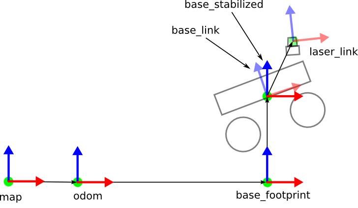
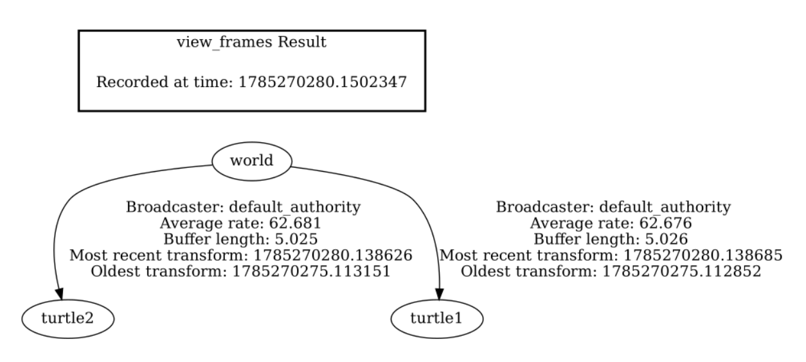
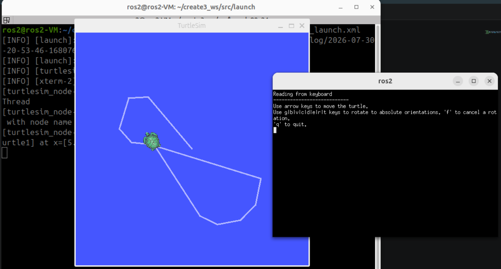
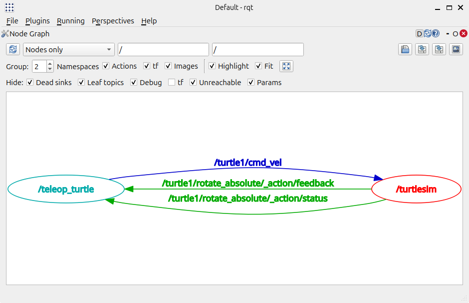
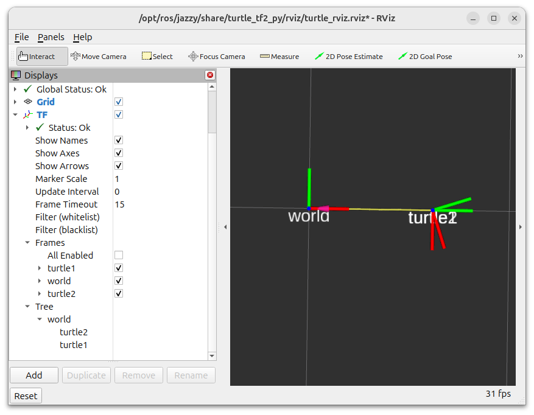
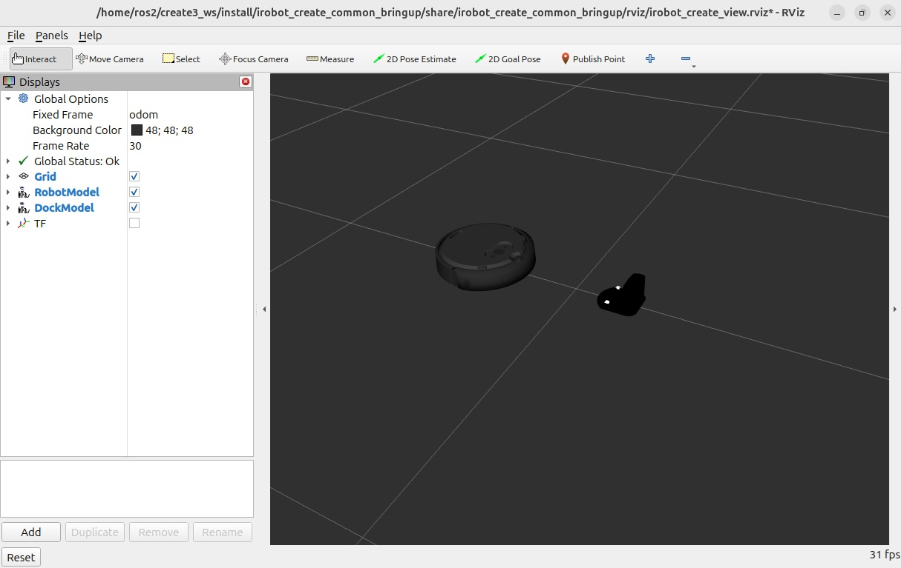
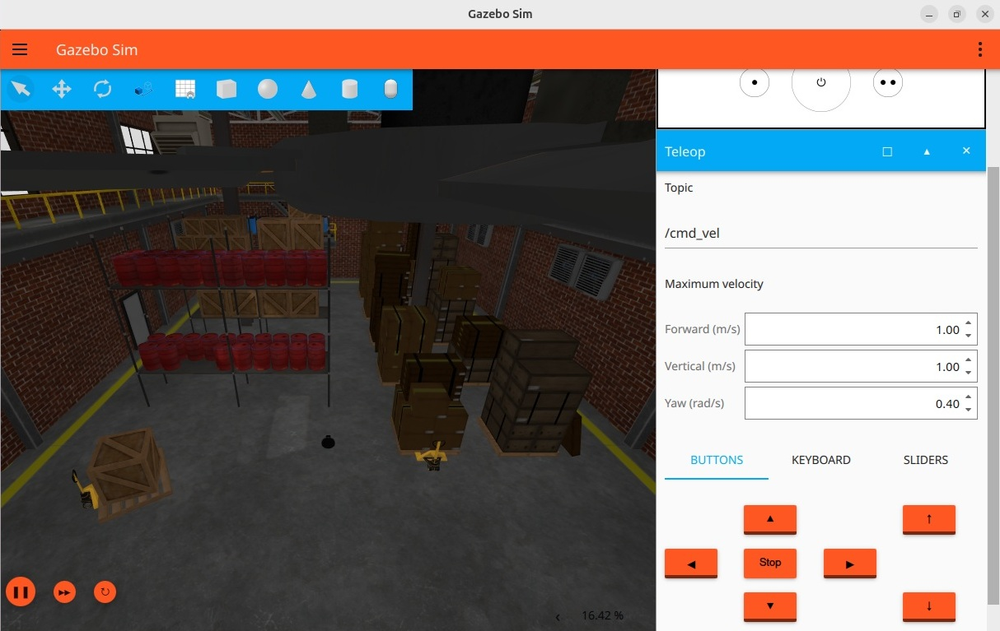

# Chapter 3 - TFs, RViz, Bags and Gazebo

This chapter covers a few important concepts that will allow you to fully harness the power of ROS 2. You will learn the role of transforms (TFs), create launch files, use ROS Bags, understand the basics of RViz and Gazebo, and add packages to your existing workspace.

## Objectives

By the end of this chapter you should:

- Understand TFs and be able to visualize them
- Know how to create launch files to automate running several nodes from one command
- Know how to use ROS Bags to record and replay data collected during a (simulated) experiment
- Be familiar with RViz and how to vizualise sensor data
- Know about simulation with Gazebo
- Know more about ROS packages and how to add them to your workspace

## 3.1 TFs (Transforms) and Coordinate Frames

In all robotics applications, keeping track of the location of various objects in relation to one another and to their environment is essential. For example, a camera can locate the objects relative to its own coordinate frame, but this information is only useful for the robot if the transformation between the camera and robot reference frames is also known.

In mobile robotics, the pose of all robot's sensors need to be defined with respect to the robot (by **_pose_** we mean **position _and_ orientation**). By its turn, the pose of the robot needs to be referred to a reference frame (also called coordinate frame) that is usually fixed in the world.

There are many possibilities to define reference frames. In ROS, a common representation is shown in Figure 1, where:

- **map**: global reference frame to define the robot's coordinates on a 2D map. It is only available when a localization system is running and it is drift-corrected.
- **odom** (Odometry Frame): world-fixed frame generated from wheel odometry - tracks the robot's movement from its starting point. Because odometry suffers from drift, after driving around for several minutes, the reported pose will likely differ from the true physical location.
- **base_footprint**: 2D representation of the robot's footprint on the ground - typically used for path planning.
- **base_link**: rigidly attached to the robot itself and moves together with it. It represents the robot's local coordinate system and is used as a reference for sensors and other components of the robot.
- **laser_link**: pose of a laser sensor on the robot - essential for interpreting its data for mapping and obstacle detection.



##### Figure 1. Commonly used coordinate frames for mobile robotics in ROS. _Source: [ROS Wiki](https://wiki.ros.org/hector_slam/Tutorials/SettingUpForYourRobot)_

Often times, there will be at more than 5 different coordinate frames and maintaining the unique transformations to and from each one of these can be challenging, especially when they might change. ROS provides a package that optimizes this process:

**tf2** is a library to keep track of multiple coordinate frames over time. It publishes the relationship between coordinate frames (transforms) using a tree structure, allowing knowledge of the transformation between coordinate frames at any point in time. In other words, transforms (TFs) are used to describe the spatial relationships between different coordinate frames by providing the transformations (translations and rotations) between them. This is crucial for navigation, localization, mapping, sensor fusion, manipulation, and any other task executed by robots.

The relationship between these coordinate frames is determined with tf-tree. It essentially tells with a tree-like structure what is the child-frame's position in relation to the parent frame.

### 3.1.1 Activity: Visualizing TFs

We are going to use TurtleSim to practice with coordinate frames and TFs. This activity is based on the one available in the [ROS documentation page](https://docs.ros.org/en/jazzy/Tutorials/Intermediate/Tf2/Introduction-To-Tf2.html).

#### Step 1: Install dependencies

Before we start, we need to install the demo package and some dependencies by running the following command:

```bash
sudo apt-get install ros-jazzy-rviz2 ros-jazzy-turtle-tf2-py ros-jazzy-tf2-ros ros-jazzy-tf2-tools ros-jazzy-turtlesim
```

#### Step 2: Run the TurtleSim tf2 Demo

Now, run the command below to open TurtleSim:

```bash
ros2 launch turtle_tf2_py turtle_tf2_demo.launch.py
```

You will see two turtles: one that starts in the center (turtle1), and another that starts at the bottom of the screen (turtle2). Turtle2 moves towards Turtle1.

Open another terminal and run the teleop node:

```bash
ros2 run turtlesim turtle_teleop_key
```

Now you can control turtle1 using the keyboard keys. Move it around and see how the turtle2 runs after it.

How is this implemented?

In this example, the tf2 library is being used to create three coordinate frames: a `world` frame, a `turtle1` frame, and a `turtle2` frame. A tf2 broadcaster is used to publish the turtle coordinate frames, while a tf2 listener is used to calculate the difference between the turtle frames. Turtle2 is moved to minimize that difference.

#### Step 3: Visualize the TF tree

By using `view_frames` we can see a diagram of the three frames being broadcast by tf2. This helps illustrate the relationship between the existing coordinate frames. Run the command below to generate a PDF file with the tree diagram:

```bash
ros2 run tf2_tools view_frames
```

Wait a few seconds until the process is completed. Then, open the Ubuntu _Document Viewer_ application and open the PDF file that was saved. You will see something similar to Figure 2. Notice that `world` is the parent frame of both `turtle1` and `turtle2` frames.



##### Figure 2. The three coordinate frames that are broadcast by tf2: world (parent), turtle1, and turtle2. Some diagnostic information is also informed, like when the oldest and most recent frame transforms were received and how fast the tf2 frame is published.

#### Step 4: Understand the representation of the frames

The command above gives you a visual representation of the TF tree, but does not show you the actual pose of each frame with respect to each other. To get such information, you can run the command `ros2 run tf2_ros tf2_echo frame1 frame2`. This will print information about translation and rotation of `frame2` with respect to `frame1`. The translation is the coordinates of the origin of `frame2`, and the rotation represents the orientation of `frame2`, both with respect to `frame1`.

Run the command below to get the pose of `turtle1` with respect to the `world`:

```bash
ros2 run tf2_ros tf2_echo world turtle1
```

This will keep printing the transformation until you stop the execution of the command. Move Turtle1 using the keyboard and see how the transformation changes.

```text
At time 1787392741.395988619
- Translation: [3.475, 9.576, 0.000]
- Rotation: in Quaternion (xyzw) [0.000, 0.000, 1.000, -0.005]
- Rotation: in RPY (radian) [0.000, -0.000, -3.131]
- Rotation: in RPY (degree) [0.000, -0.000, -179.404]
- Matrix:
 -1.000  0.010  0.000  3.475
 -0.010 -1.000  0.000  9.576
  0.000  0.000  1.000  0.000
  0.000  0.000  0.000  1.000
```

Because the pose of coordinate frames can change at any moment, the transformations are constantly updated. For this reason, the `tf2_echo` command also informs the exact moment in which the transformation was calculated (`At time` field).

As you can see, the pose of `turtle1` is printed in different formats. You can read it as _translation_ and _rotation_ independently, or combined in the form of a homogeneous matrix. Also, the rotation is also representated in quaternion or roll-pitch-yaw (RPY) angles. Those are all different representations of the same mathematical transformation.

Now, investigate the pose of Turtle2 with respect of Turtle1: 

```bash
ros2 run tf2_ros tf2_echo turtle1 turtle2
```

Move Turtle1 around and verify how the values change while Turtle2 is moving.

## 3.2 Launch Files

Launch files allow us to run multiple nodes at once, including defining arguments to pass them on startup. This allows us to launch a complete application with whatever configuration we need using a single command and on a single terminal.

In the previous activity for visualizing TFs, we made use of a launch file when we ran the command `ros2 launch turtle_tf2_py turtle_tf2_demo.launch.py`. In the next activity, we will create a launch file to load TurtleSim and teleoperation nodes from one command.

### 3.2.1 Activity: Creating a Launch File

In this activity, we will create a simple launch file that launches the TurtleSim and the teleoperation nodes at once. This activity can also be found on the ROS2 docs [here.](https://docs.ros.org/en/jazzy/Tutorials/Intermediate/Launch/Creating-Launch-Files.html)

#### Step 1 - Steup

Most of the time, you will find launch files stored inside a `launch` directory inside each package's directory. In our case, we will just create it inside our `src` directory. First, navigate to the `/create3_ws/src` directory and create a `launch` directory:

```bash
 cd ~/create3_ws/src
 mkdir launch
 cd launch
 ```

ROS launch files can be written in Python, YAML, or XML. We will practice with XML format, which is the simpler one (I think).

Create an empty XML file inside your new `launch` directory:

```bash
touch turtlesim_teleop_launch.xml
```

We will also need to install the xterm package for this exercise, so install it now with:

```bash
sudo apt install xterm
```

#### Step 2 - Write the launch file

We are going to create a simple launch file that launches both `turtlesim_node` and  `turtle_teleop_key` executables from the `turtlesim` package. Open your newly created file (for example, with VScode: `code touch turtlesim_teleop_launch.xml`). Copy and paste the code below into the launch file:

```xml
<launch>
  <node pkg="turtlesim" exec="turtle_teleop_key" output="screen" launch-prefix="xterm -e"/>
  <node pkg="turtlesim" exec="turtlesim_node"/>
</launch>
```

As you can see, the syntax for launch files is relatively intuitive: to run a node you must define its package name (`pkg`) and executable file name (`exec`). Optionally, you can also add other parameters like `output` and `launch-prefix`.

`turtle_teleop_key` requires keyboard input from the terminal. When launched from a launch file, it may not properly capture keystrokes depending on your terminal. We installed `xterm` because this terminal works well in those situations. Then, we added the option `launch-prefix="xterm -e"` to instruct it to open a new `xterm` window to run teleop on it.

You can find out a lot more of what launch files are capable of by following the [ros2 tutorials](https://docs.ros.org/en/jazzy/Tutorials/Intermediate/Launch/Launch-Main.html).

#### Step 3 - Launch

The syntax for using launch files is:

```bash
ros2 launch <package_name> <launch_file_name>
```

In our case, since this launch file is not part of a package, we can launch it directly:

```bash
cd ~/create3_ws/src/launch
ros2 launch turtlesim_teleop_launch.xml
```

You should now be able to see two windows, one for the teleop node, and one for the turtlesim node. The one for the teleop node is the smaller one on the right of Figure 3, which is the `xterm` terminal.



##### Figure 3. Result of running the `turtlesim_teleop_launch.xml` launch file: the original terminal is in the back. TurtleSim window in in the center, and the small terminal next to it is xterm running the teleoperation node.

## 3.3 ROS Bags

As you might have noticed, data sent over topics is not inherently persistent. If a message is not captured by any node, there is no way for it to be replayed back or stored. Although this behaviour is useful in many ways, sometimes data persistence is necessary. For example, when optimizing or testing algorithms, it can be very useful to capture data once during a data collection phase, and using that data later for optimizing algorithms or as training data. Fortunately, ROS provides a utility that addresses this issue.

The `rosbag` utility allows you to store and replay topic data through the CLI commands. In the next activity we will understand the basic concepts of ROS bags. You can find more details about this package in the [ROS2 tutorials](https://docs.ros.org/en/jazzy/Tutorials/Beginner-CLI-Tools/Recording-And-Playing-Back-Data/Recording-And-Playing-Back-Data.html).

### 3.3.1 Activity: Recording and playing back data with ROS Bags

In this activity, we will record a few topics in TurtleSim using the `rosbag2` package. Then, we will replay them again. This activity can be found on the [ROS2 wiki](https://docs.ros.org/en/jazzy/Tutorials/Beginner-CLI-Tools/Recording-And-Playing-Back-Data/Recording-And-Playing-Back-Data.html).

#### Step 1 - Setup

First, let's create a directory to store our rosbag files. Open a terminal and run the following commands:

```bash
mkdir ~/rosbag_dir
cd ~/rosbag_dir
```

Now, run the turtlesim and turtle_teleop nodes using the launch file created in the previous activity:

```bash
cd ~/create3_ws/src/launch
ros2 launch turtlesim_teleop_launch.xml
```

#### Step 2 - Record a topic

We will record the `/turtle1/cmd_vel` topic, which contains all the velocity commands sent from the teleop node to turtlesim. To record a topic, we can use the following syntax:

```bash
ros2 bag record <topic_name>
```

Alternatively, you can record multiple topics in the same bag:

```bash
ros2 bag record <topic1_name> <topic2_name> 
```

It is good practice to define the name of the file that contains your bag. You can do it by using the `-o` flag:

```bash
ros2 bag record -o <file_name> <topic_name>
```

To record the `/turtle1/cmd_vel` topic in the file `turtle_movemen`, open a new terminal window and run:

```bash
cd ~/rosbag_dir
ros2 bag record -o turtle_movement /turtle1/cmd_vel
```

You will see messages similar to those:

```bash
[INFO] [1664530714.080295473] [rosbag2_storage]: Opened database 'rosbag2_2022_09_30-11_38_34/rosbag2_2022_09_30-11_38_34_0.db3' for READ_WRITE.
[INFO] [1664530714.080414474] [rosbag2_recorder]: Listening for topics...
[WARN] [1664530714.081898406] [rosbag2_transport]: Hidden topics are not recorded. Enable them with --include-hidden-topics
[INFO] [1664530714.083271733] [rosbag2_recorder]: Subscribed to topic '/turtle1/cmd_vel'
[INFO] [1664530714.083715109] [rosbag2_recorder]: All requested topics are subscribed. Stopping discovery...
```

Now, switch to your teleop terminal and move the turtle in a pattern that you can recognize later. When you are done, press `CTRL+C` to end the recording.

#### Step 3 - Inspect the rosbag

You can find out information about the exact data stored inside the rosbag by using the command `rosbag info <bag_name>`. To inspect the rosbag we just recorded, run:

```bash
ros2 bag info turtle_movement
```

You should see something similar to this:

```bash
Files:             turtle_movement_0.mcap
Bag size:          11.7 KiB
Storage id:        mcap
ROS Distro:        jazzy
Duration:          8.057979869s
Start:             Jul 30 2026 21:30:34.498193477 (1785439834.498193477)
End:               Jul 30 2026 21:30:42.556173346 (1785439842.556173346)
Messages:          65
Topic information: Topic: /turtle1/cmd_vel | Type: geometry_msgs/msg/Twist | Count: 65 | Serialization Format: cdr
Service:           0
Service information: 
```

This shows you information about the exact topics recorded, their message types, the duration of the recording as well as some metadata about the bag itself like its size.

#### Step 4 - Replay the files

Now we can replay our recorded topic data. Keep the TurtleSim window open and run the following command:

```bash
ros2 bag play turtle_movement
```

If you have the turltesim window still open, you should see that your turtle repeat the same movements you gave before! Unless the turtle starts exactly at the same pose (position and orientation), it will not follow the same path, but it will reproduce the same relative movements. This is because the bag is playing messages to the topic `/turtle1/cmd_vel` at the same rate they were recorded.

These same process can be applied to any ROS topic, including images. Common use cases include collecting sensor data for training models, optimizing controllers, developing sensor fusion, and evaluating the performance of different algorithms.

#### Step 5 - Visualizing with rqt

`rqt` is a graphical interface for visualizing ROS-related data. You can call it by simply running:

```bash
rqt
```

When running it for the first time, the window will be blank. Select `Plugins > Introspection > Node Graph` from the menu bar at the top. A window like the one in Figure 4 will open showing the nodes that are publishing or subscribing to which topics. If the window is blank, click the "reload" button below the "File" menu.



##### Figure 4. Node graph in rqt: it shows the running nodes and indicates which one is publishing or subscribing to which topic.

With `rqt` you can also plot graphs, inspect topics, call services etc.. Play around with the options to see the different visualization possibilities.

## 3.4 RViz

RViz is another visualization tool for ROS, but it is much more advanced than rqt. RViz stands for **ROS Visualization**. It is **not** a simulator, but a 3D visualization tool that can be used to visualize all kinds of robot data (real or simulated), from sensor data to actuators. It can be used together with a simulator (like Gazebo) to display existing data being published in topics.

### 3.4.1 Activity: Visualize tfs with RViz

In this activity we will see how we can use RViz to visualize transforms. 

#### Step 1 - Run the TurtleSim tf2 Demo

We are going to run the same demo we used in the first activty of this chapter. Open a new terminal and run the command below to open TurtleSim:

```bash
ros2 launch turtle_tf2_py turtle_tf2_demo.launch.py
```

Open another terminal and run the teleop node:

```bash
ros2 run turtlesim turtle_teleop_key
```

#### Step 2 - Run RViz

In Activity 3.1.1 we visualized a static picture of the TF tree (Figure 2). RViz can also show the TFs, but in a dynaic way. For that, we will start RViz with a configuration file using the -d option. Open another terminal window and run:

```bash
ros2 run rviz2 rviz2 -d $(ros2 pkg prefix --share turtle_tf2_py)/rviz/turtle_rviz.rviz
```

Figure 5 shows a screenshot of RViz with the TFs. As you send commands to the turtle using teleop, you should see the TFs moving on the screen.



##### Figure 5. RViz screenshot displaying the TFs of turtle1, turtle2 and world. In the left side menu you can select many options for visualization. 

This is just a simple example, but RViz is much more powerful! For example, Figure 6 shows a screenshot of RViz with the Create3 robot. For details on how to use this tool, check out the [RViz User Guide]((https://docs.ros.org/en/jazzy/Tutorials/Intermediate/RViz/RViz-User-Guide/RViz-User-Guide.html)).



##### Figure 6. RViz screenshot with the Create3 robot. The menu on the left side allows you to control what RViz shows, which can include sensor data, reference frames etc..

## 3.5 Gazebo

[Gazebo](https://gazebosim.org/home) is an open-source 3D **robotics simulator** that is very commonly used to simulate robots using ROS. Gazebo uses the ODE physics engine, supports OpenGL rendering and has a vast community that provides plugins for simulating all kinds of sensors and actuators.

With Gazebo, you can create a fully virtual version of you robot, as well as all its sensors and actuators and test it in any virtual environment you need. For most commercially available robots, you will find that the company that created the robot usually provides all the files required to create that simulation, such as a 3D model of the robot, the robot's [URDF model](https://docs.ros.org/en/jazzy/Tutorials/Intermediate/URDF/URDF-Main.html), and Gazebo plugins that can simulate all its sensors and actuators.

From the perspective of a robot programmer, Gazebo can be very useful as it's simulation publishes nearly identical topics to the ones the real robot does, which means we can test all our code in simulation before deploying to the live robot. You can create a world for your robot using Gazebo's world editor, or you can use one of the hundreds of community-created worlds. Figure 7 shows a screenshot of Gazebo running a simulation of the Create3 robot.



##### Figure 7. Gazebo screenshot showing the simulation environment. You can control the robot by clicking the command buttons on the bottom right. 

More often than not, Gazebo is used to stress test the code before deploying, as it allows us to test any kind of algorithm freely without the risk of damaging the robot or any expensive equipment. It can also save incredible amounts of time as the simulation can be sped up to be many times faster than realtime, but the speed of the simulation largely depends on the machine running the simulation as it can often times be very resource intensive.

For more information about Gazebo, check its [getting started guide](https://gazebosim.org/docs/harmonic/getstarted/) and [Simulation Tutorials](https://gazebosim.org/docs/harmonic/tutorials/).

> Unfortunately, Gazebo is quite resource demanding and usually does not run well in virtual machines.

## 3.6 Packages

We dealt with packages in Chapter 1, when we created our own simple package with two nodes (a publisher and a subscriber). But a ROS package can contain much more than nodes, like ROS-independent libraries, datasets, configuration files, third-party software, or anything else that logically constitutes a useful module. If you want to be able to install your code or share it with others, then you’ll need it organized in a package. With packages, you can also use ROS 2 software developed by the ROS community. That's what we are going to do in this Chapter.

One of the biggest advantages of using ROS is its community and vast collection of packages. A lot of the most common use cases in robotics have official ROS packages created and supported by the team behind ROS, and for virtually any other use case, you can probably find a communty-created ROS package.

Often, you will need to install packages to interface sensors or external devices such as cameras, LiDARs or other sensors with your ROS-based robot. You might also need to install a ROS package that contains an algorithm that might help you in your project (e.g: sensor-fusion, localization, or mapping). For almost all of these cases, you will be able to find them on Github, but you will often need to check if they are compatible with your version of ROS.

Some commonly used ROS packages that you should at least know about are:

- [**Nav2**](http://nav2.org/) is the successor of the ROS Navigation Stack for mobile robot navigation. It provides easily-customizable methods for dynamic path planning, obstacle avoidance, behavior tree implementation etc.. It is used for all types of navigation applications, including drone navigation (see [Elroy Air](https://elroyair.com/)).

- [**MoveIt**](https://moveit.ai/) is a motion planning framework based on ROS. It is one of the most comprehensive and widely used ROS packages. It provides complete motion and grasp planning support for robotic manipulators of all types. It is widely used in a variety of fields and companies, like NASA, Google, Microsoft, and Samsung.

Later in this chapter we will practice how to add packages to our existing workspace.

### 3.6.1 Activity: Adding Packages to the your workspace

This activity will focus on adding new packages to your workspace that will allow you to simulate the Create3 robot and visualize its data. We will need to clone some dependencies from Github and build the workspace again.

#### Step 1 - Clone packages

Now we will clone a couple of packages from GitHub: the [Create3 simulation](https://github.com/iRobotEducation/create3_sim) and the [Create3 examples](https://github.com/iRobotEducation/create3_examples) packages. We will download them from their respective Github repositories.

Navigate to the `src` directory in your workspace and clone the packages from GitHub:

```bash
cd ~/create3_ws/src
```

Clone the iRobot® Create® 3 Simulator repository for ROS 2 Jazzy:

```bash
git clone https://github.com/iRobotEducation/create3_sim.git --branch jazzy
```

And the Create3 Examples for ROS 2 Jazzy:

```bash
git clone https://github.com/iRobotEducation/create3_examples.git --branch jazzy
```

#### Step 2 - Install dependencies

Some ROS packages require other packages to work properly (we say that they _depend_ on other packages). The packages we just downloaded need a lot of other packages and other system-dependencies before they can be used. Downloading such dependencies manually would take a very long time and would be prone to error. `rosdep` is a command-line tool for installing dependencies related to ROS packages.

To install the dependencies for the packages installed, navigate to the top of your workspace and use the `rosdep install` command:

```bash
cd ~/create3_ws/
rosdep install --from-path src --ignore-src -yi
```

This will install all the required dependencies in the workspace. This process may take a while depending on how extensive the packages are and how fast your system and Internet connection are.

You should see many messages to inform you about the installation process while it is being executed. Wait until the installation finishes before moving to step 3. If everything works correctly, the final message should indicate that all required dependencies were installed successfully:

```bash
.
.
.
Setting up ros-jazzy-controller-manager-msgs (4.45.2-1noble.20260615.105226) ...
Setting up ros-jazzy-controller-manager (4.45.2-1noble.20260615.164916) ...
Setting up ros-jazzy-gz-ros2-control (1.2.19-1noble.20260615.171757) ...
#All required rosdeps installed successfully
```

#### Step 3 - Build the workspace

Because we made changes to our workspace, we need to build it again. We will use the same build tool that we used in the activity of Chapter 1. Navigate to your main workspace directory and build it using the `colcon build` command:

```bash
cd ~/create3_ws
colcon build --symlink-install
```

This process usually takes a while, depending again on the speed of the system (it took more than 3 minutes in my machine). When the build process is complete you should see a message similar to this:

```bash
Summary: 16 packages finished [3min 28s]
```

#### Step 4 - Update a package (if needed)

In some cases, the installed ROS packages might not be fully compatible with your ROS installation. If you are running the virtual machine provided by me, this is the case. In particular, `ros-jazzy-controller-manager` is newer than `ros-jazzy-diagnostic-updater`, which can be verified by running the command:

```bash
apt list --installed | grep diagnostic-updater
```

The expected result is:

```bash
ros-jazzy-diagnostic-updater 4.2.7
```

If your version is older than that, you should update the package:

```bash
sudo apt update
sudo apt install ros-jazzy-diagnostic-updater
```

After that, run the command above to list the installed packages again to verify that it now has the correct version.

#### Step 5 - Source your workspace

Remember that you need to source your workspace every time you open a new terminal in order to run the packages installed in it:

```bash
cd ~/create3_ws
source install/local_setup.bash
```

#### Step 6 - Test your installation

The packages we installed include files that allow simulating the Create3 in Gazebo and visualize it in RViz. We are going to discuss Gazebo and RViz in the next section. For now, you can test your installation by running the create3_gz launch file (which loads RViz, Gazebo and related nodes):

```bash
ros2 launch irobot_create_gz_bringup create3_gz.launch.py
```

During the launch process, you will see many log messages in the terminal and two new program windows. It might take a long while for all nodes to be loaded but, when everything is running, you should see a window with with RViz and another with Gazebo. If everything works as expected, RViz and Gazebo should look like the screenshots shown in Figures 1 and 2.

To close these windows, go back to the terminal where you launched them and press `CTRL + C`. **It is not recommended to close the windows manually as it might cause issues!**

After waiting for a few minutes for Gazebo to fully launch, open a new terminal window and run the `ros2 topic list` command to see the list of topics published by the Gazebo simulation node:

```bash
/battery_state
  /clicked_point
  /clock
  /cmd_audio
  /cmd_lightring
  /cmd_vel
  /diffdrive_controller/cmd_vel_unstamped
  /dock
  /dynamic_joint_states
  /goal_pose
  /hazard_detection
  /imu
  /initialpose
  /interface_buttons
  /ir_intensity
  /ir_opcode
  /joint_states
  /kidnap_status
  /mouse
  /odom
  /parameter_events
  /performance_metrics
  /robot_description
  /rosout
  /sim_ground_truth_dock_pose
  /sim_ground_truth_pose
  /slip_status
  /standard_dock_description
  /stop_status
  /tf
  /tf_static
  /wheel_status
  /wheel_ticks
  /wheel_vels
```

The topics being published are almost the same as the ones published by the real Create3 robot, which facilitates testing our code in simulation.

#### Possible issues

If you are running ROS on a virtual machine, it is very possible that Gazebo will not run properly. Performance inside a VM may still be poor due to flickering, low frame rate, slow simulation, camera rendering issues etc.. Unfortunately, there's not much to do to fix this because Gazebo is quite demanding. If possible, use a machine with native Ubuntu 24.04 and ROS to run Gazebo.

RViz typically continues to work correctly even when Gazebo rendering is poor.

Another possible issue is that Gazebo opens but the simulation does not start. If RViz and Gazebo open, but then Gazebo crashes and the simulation never starts, it might be because it starts paused (that's what happened in my case, for hatever reason). You can verify that by running:

```bash
gz topic -e -t /world/depot/stats
```

If the output is `paused: true`, then you should unpause it as soon as Gazebo opens. To do that, prepare two terminal windows: one with the command to launch the simulation

```bash
ros2 launch irobot_create_gz_bringup create3_gz.launch.py
```

and another with the service call to unpause it:

```bash
gz service \
  -s /world/depot/control \
  --reqtype gz.msgs.WorldControl \
  --reptype gz.msgs.Boolean \
  --req 'pause: false'
```

First, run the ros2 launch command. As soon as Gazebo window opens, go to the other terminal and run the service call to unpause it. This should prevent Gazebo from crashing.

## Navigation menu

- Continue to [Part 2 - Create3](../../Part_2-Create3/readme.md)
- Go back to [Part 1 - ROS](../../Part_1-ROS/readme.md)
- Go to the [Main page](../../readme.md)
