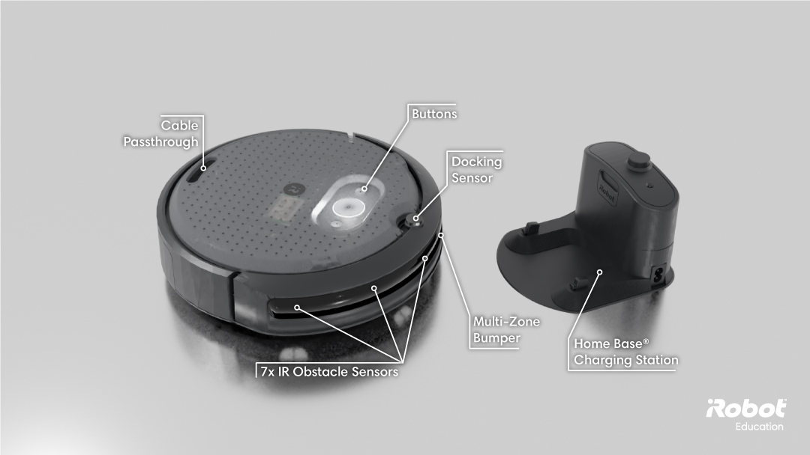
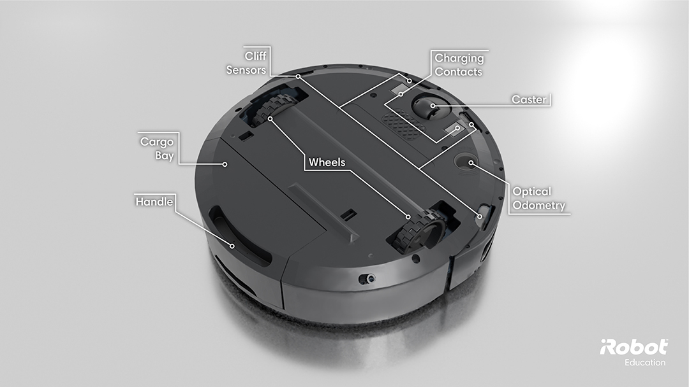

# Chapter 4 - Introduction to the iRobot Create3

The Create3® is an educational robot made by iRobot, who you may know as the company that created the Roomba® vacuum cleaner. We will use the Create3 robot to practice with some of the concepts studied in Part 1, so it is a good idea to get familiar with the robot first.

## 4.1 Robot Overview

The Create 3 is based on the Roomba vacuum cleaner robot. Its sensors, actuators, and compact design allow it to autonomously navigate a the whole floor of a home or office space.

Figure 1 illustrates the Create3 with its charging base and some of its sensors. The front of the robot features a bumper and seven infrared (IR) proximity sensors, both of which can be used to detect obstacles. The top of the robot contains three programmable buttons: the biggest one in the center can also be used to power the robot down; buttons 1 and 2 (the small ones) are programmable by the user - button 1 is also used to set robot in Standby mode.

The Home Base Charging Dock is used to both power on the robot (when it is placed on it) and to charge its battery. The robot has an IR Docking Sensor to locate the home base.

##### Figure 1. Create3 robot (left) and its charging base (right). Seven infrared proximity sensors and a front bumper can be used to detect obstacles during navigation. The top buttons can be used to send commands to the ROS 2 application that controls the robot. _Source: [Create3 Docs](https://iroboteducation.github.io/create3_docs/hw/overview/)_

The Light Ring glows different colors and patterns to communicate robot status and/or errors, like battery level, WiFi connection, firmware updating etc... Users can also program the light. Check out [this guide](https://iroboteducation.github.io/create3_docs/hw/face/) to see how the light ring indicate the different operating status.

Figure 2 shows the bottom side of the Create3, which contains four infrared sensors pointing to the ground (cliff sensors), a front caster wheel, charging contacts, two driving wheels (differential-drive structure), and the openning for the cargo bay.

##### Figure 2. Bottom of the Create3 with indication of cliff sensors, optical odometry sensor, and wheels. _Source: [Create3 Docs](https://iroboteducation.github.io/create3_docs/hw/overview/)_

Besides the sensors shown in Figures 1 and 2, the Create3 also has wheel encoders and an IMU. Together with the optical odometry sensor, an internal sensor fusion algorithm generates an estimation for the robot pose (position and orientation).

This section is an excerpt from the [create3 docs](https://iroboteducation.github.io/create3_docs/hw/overview/), head over there if you want to find out more about the robot.

## 4.2 Powering the robot ON

To power on the robot, place it on the charging dock. The green LED on the dock will glow for a few seconds to indicate successful connection, and the robot’s Light Ring should glow a bright spinning light. The Light Ring will continue to spin as the robot boots up. When the process is complete, the robot will chime a “happy sound.” The Ring Light will then transition to a slower spinning white light if still on the charging dock, or a solid white light when removed.

## 4.3 Powering the robot OFF

There are two ways to power down the robot: Standby Mode and Storage Mode:

**Standby Mode** (or Low Power Mode) can be used to extend your robot’s battery without completely powering it off. In this state, your robot will keep its payload power alive (Raspberry Pi or LiDAR, for example) and will be able to charge, but will not respond to WiFi, USB or Bluetooth. Keep in mind that Standby Mode is **not intended for long-term storage!**

> To enter Standby Mode, press and hold Button 1 for ten seconds. After ten seconds, the Light Ring should turn off to indicate standby mode. To exit Standby Mode, press and hold the center button for one (1) second.

In **Storage Mode** your robot’s battery will power off completely. To turn the robot back on (from Storage Mode) you must place it on the charging dock.

> To enter Storage Mode, press and hold the center button for seven seconds while NOT at the charging dock. The Light Ring will pulse bright white three times and then play the “power down” sound. After ten seconds, the Light Ring should turn off.

## 4.4 Activity: Programming the Create3 with Python Web Playground

The Create3 robot can be programmed in Python via a web interface that does not require interacting with ROS. The only requirements are that your computer has Bluetooth® and in that you use Python Web Playground in a Bluetooth®-supported web browser, such as Google Chrome.

Follow the steps below to practice with the Create3 robot using the Python Web Playground.

### Step 1 - Power the robot ON

Place it on its charging dock to power it ON. **Keep the robot on the ground when it is ON to avoid accidents!** The cliff sensors are not perfect.

### Step 2 - Python Web Playground

Access [https://python.irobot.com/](https://python.irobot.com/) using Chrome or another a Bluetooth®-supported web browser. The screen is divided in three areas and a menu on the top. The areas below the menu are where you are going to write your Python code (left) and select example files to open (right). At the bottom there is a console where you will see messages printed by the running code.

### Step 3 - Connect to the robot

In the menu, click the "Connect" button. Look for your robot name on the list, select it, and click connect.

> _Important_: Make sure that your robot is switched to Bluetooth mode. If you are working with more than one robot, Bluetooth connection must be completed for **one robot at a time** to avoid errors.

### Step 4 - Run the example code

In the area to the right, go to the folder `create3_robot` and click on the `ir_proximity_obstacles.py` to open it (the examples located in the `create3_robot` folder are designed to work on the Create3).

Run the code by clicking the "play" button on the top left of the screen.

### Step 5 - Test the proximity sensors

Hover your hand in front of the proximity sensors and check how the light ring changes.

### Step 6 - Investigate the IR sensors

Now, run the `ir_proximity_print.py` example to answer the following questions:

* What is the maximum range of the IR proximity sensors?
* Where are each of the IR proximity sensors located?
* How do their values relate to distance? Are the sensors linear?

### Step 7 - Study how Python works on the Create3

Code is written in Python, with special functions to control the robot. Functions can receive a “decorator” that indicates how they must behave. For example, the decorator `@event(robot.when_play)` indicates that the function will be executed when the `robot.play()` function is called in your code. Note that many functions can have the same decorator, and they will all be executed simultaneously when the corresponding event occurs.

Go to the [Python Cheat Sheets](https://iroboteducation.github.io/create3_docs/lessons/pwp/cheat-sheets/) and read the section "Python Explanation" to learn more.

### Step 8 - Explore other examples

Explore other examples available in the folder `create3_robot` to examine the code and see how the robot behaves.

Modify some of the programs to change the behavior of the robot. Try to make the robot follow a wall, for example.

### Step 9 - Power the robot OFF

When you are done, Power Off the robot (Storage Mode) and put the it back into the box together with its charging dock and power cable.

## Conclusion

After completing this Chapter, you should be familiar with the iRobot Create3, its sensors, and some of its limitations. You should also know how to use iRobot's Python Web Playground to program the robot. In the next Chapter, we will use ROS instead of the Python Web Playground to program the Create3 robot.

## Navigation menu

- Go back to [Chapter 3](../../Part_1-ROS/Chapter-3/readme.md)
- Continue to [Chapter 5](../../Part_2-Create3/Chapter-5/readme.md)
- Go to the [Main page](../../readme.md)